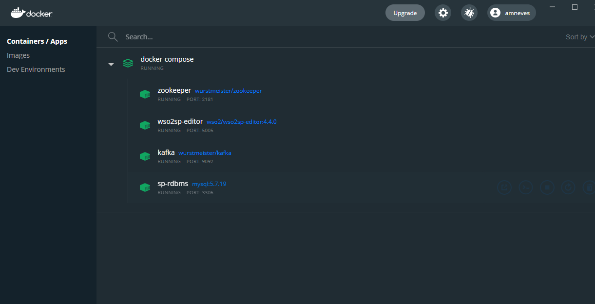

# Docker Resources for WSO2 Stream Processing

# Prerequisites:
* Docker Desktop: https://docs.docker.com/docker-for-windows/install/
* (optional) mysql workbench: https://www.mysql.com/products/workbench/
* Note: Some docker containers may not work on MacOS

# how to deploy working environment:
1. git clone https://github.com/iamnives/docker-sp
2. cd .\docker-sp\docker-compose\
3. docker-compose up
4. Wait for docker-compose to launch all the containers. Check with docker UI.
    * 
4. Open the wso2sp editor: http://localhost:9390/editor
5. Your working enviroments should be fully setup at this point. Any changes on the docker compose would have to be restarted.

# Changing docker settings

This repository uses the docker-compose.yml file in 'docker-compose' folder to setup the containers. This file starts all the containers, mounts your local volumes to the dockers, and exposes some docker ports. Check https://docs.docker.com/compose/gettingstarted/ for more info.

You shouldn't need to mess with much settings here, but there are 3 important ones that could be usefull.
* Port mapping.
    * 
    * Add any necessary port mapping to allow interacting with the docker containers from an outside source. Remember that docker containers are also connected via a docker compose default network, addressable by docker name.
* Volume and file binding.
    If you wish to bind any other folder or files (so docker containers can see folders in your local PC) use the following examples:
    * For folders: 
    * For single files: 
    * Warning: If you map a single file without the type bind it will be overwritten.
* Environment variables.
    * 

# Database setup
The mysql docker containers runs the script in 'mysql/scripts/mysql.sql' after startup. This script already contains the SweetFactoryDB used in the 'Database integration'. it also creates a 'wso2carbon' user with password 'wso2carbon', this user has full permissions on the database. 

Feel free to add any aditional setup SQL code in this file (aditional tables, users, databases, etc...), just take into account that the code can run on docker compose even if the database already exists. 

When you do the tutorial you can skip the "Before you begin" section.

You are free to use mysql workbench to change the databases and create new ones, change tables or view data. You can also use the mysql console inside the docker container by using the CLI button on docker UI or the command "docker exec -it sp-rdbms /bin/bash"

## Important: Reseting the database server
You can delete the 'dbdata' folder on 'docker-compose/dbdata', this will delete everything about the database and it will be reconstructed on the next docker compose.

# Useful tutorials:
* Get used to the editor: https://docs.wso2.com/display/SP440/Creating+a+Simple+Siddhi+Application
* Consuming events from external source: https://docs.wso2.com/display/SP440/Consuming+Events
* Pre-process data: https://docs.wso2.com/display/SP440/Pre-processing+Streaming+Data
* Database integration: https://docs.wso2.com/display/SP440/Integrating+Datastores

# Kafka integration
## Testing kafka
You may want to test the kafka connection by using the provided HelloKafka.siddhi example.
 1. Open and read the HelloKafka.siddhi example on wso2 editor
 2. Run HelloKafka.siddhi
 3. Open kafka CLI console in Docker or use "docker exec -it kafka /bin/bash"
    * 
 4. Inside the kafka cli: cd usr/bin
 5. Inside the kafka cli: kafka-console-producer.sh --broker-list kafka:9092 --topic productions

This will open an interactive kafka producer interface, publish events of the type: `{"name": "Jaffa Cake","amount": 2.0}`. Change the parameters around to make sure everything is working correcly. Effects of this will be seen on the wso2 editor console. Note that the alerts will only be sent for production batches with less than 10 amount. 

## Publishing Taxi data to a kafka topic from the CSV:
This section covers how to publish the CSV Taxi data to a kafka topic, which will be used to test and develop your work.
1. Make sure to put the csv files (found on the GDrive) under docker-compose/kafka-data/
    * 
2. Click "CLI" button on docker UI or use "docker exec -it kafka /bin/bash" in the command line
    * 
3. Inside the kafka cli: cd usr/bin
4. Run the the provided KafkaReceiveAndCount example on the editor.
5. Run on the kafka CLI: kafka-console-producer.sh --bootstrap-server kafka:9092 --topic productions < * kafka-data/sample_data.csv
    * This command gets the csv data and publishes it to the topic "productions" on "kafka:9092"
    * You can use all the kafka scripts from this directory if you need.
6. Watch the terminal logs on the editor.

### Usefull Kafka scripts:
1. Connect to kafka console through docker. 
2. cd usr/bin to find the following scripts

* See group ids: kafka-consumer-groups.sh --bootstrap-server kafka:9092 --list
* See kafka topics: kafka-topics.sh --list --bootstrap-server localhost:2181

* Interactive CLI record publisher: kafka-console-producer.sh --broker-list kafka:9092 --topic productions

* Read kafka topics: kafka-console-consumer.sh --topic consume --from-beginning --bootstrap-server kafka:9092

# Common errors (more will be added as they are found)

Wso2 editor does not connect to kafka

Make sure to use 'kafka' as the url identifier and not 'localhost' or an IP. ex 'kafka:9092'

Containers can not see eachother

Containers are connected though the docker-compose default network. Use the address with the containter name instead of an IP address. ex: 'jdbc:mysql://sp-rdbms:3306'

Stream sink does not recieve http requests

Make sure to setup the source url as '0.0.0.0' instead of 'localhost'.

Connection to mysql strore fails

Make sure your store settigns are setup with the following attributes, address by name, useSSL=false, and correct password and user.
<code>@store(type='rdbms', jdbc.url="jdbc:mysql://sp-rdbms:3306/SweetFactoryDB?useSSL=false", username="wso2carbon", password="wso2carbon" , jdbc.driver.name="com.mysql.jdbc.Driver")</code>

